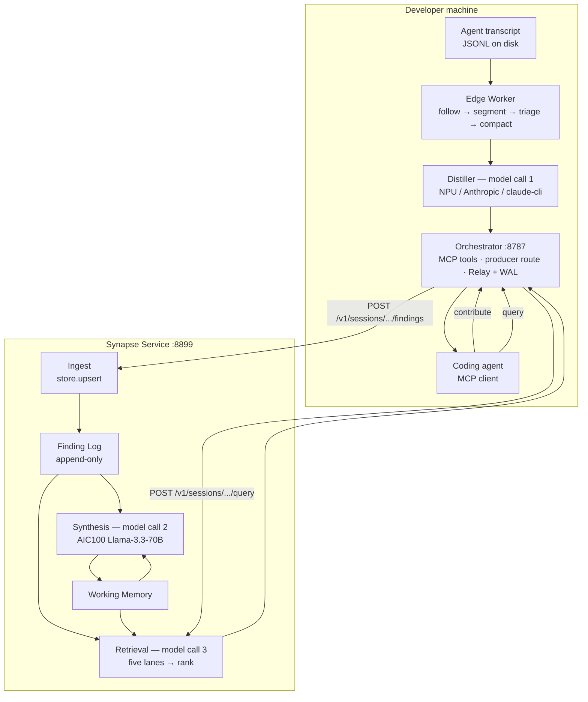

<div align="center">

# Synapse

**Shared working memory for AI-assisted teams — every agent learns what the whole team knows.**

[](https://github.com/SinghSiddharth01/Synapse/actions/workflows/ci.yml)
[](https://SinghSiddharth01.github.io/Synapse/)
[](https://github.com/SinghSiddharth01/Synapse/releases/latest)
[](LICENSE)
[](pyproject.toml)
[](docs/JOIN-WINDOWS.md)

[**Quickstart**](#quickstart) · [**How it works**](#how-it-works) · [**Installation**](#installation) · [**MCP tools**](#the-mcp-tools) · [**Docs**](https://SinghSiddharth01.github.io/Synapse/) · [**Contributing**](docs/contributing.md)

</div>

---

## Overview

When several engineers work toward the same goal, their agents each hold a different slice of the same problem — and those slices never meet. One person's agent spends an hour ruling out a theory that the person next to them ruled out yesterday.

Synapse closes that gap without changing anyone's workflow. A lightweight **Edge Worker** tails the local agent's transcript on-device. A small model **distils** it into structured *Findings* — key learnings, decisions, dead ends, open questions — each stamped with its contributor. A local **Orchestrator**, the single egress point per machine, ships only those Findings to a **Synapse Service** that a teammate hosts on the LAN, where a large model merges everyone's Findings into one shared memory: deduplicating semantically, flagging conflicts, keeping a bounded prose summary. Agents read it back on demand through six MCP tools.

**What makes it different**

- **Passive, not per-insight opt-in.** The worker observes an *unmodified* agent session. Agents are detected, never configured.
- **Private by construction.** The Edge Worker is the only component that ever sees raw transcript text. Only abstracted Findings leave the machine.
- **One egress per machine.** The MCP server is local and speaks streamable HTTP, never stdio — stdio would spawn one server per client and dissolve the property.
- **Semantic merge, not id dedup.** Two people reaching the same insight in different words produce one Finding carrying both attributions.
- **Nothing is injected unprompted.** Agents ask; Synapse answers.

## Quickstart

Install the client, point it at your team's service, and start it. No clone, no build.

**Windows / Snapdragon X Elite** — the primary target: on-device distillation runs on the Hexagon NPU.

```powershell
& ([scriptblock]::Create((irm https://raw.githubusercontent.com/SinghSiddharth01/Synapse/main/install.ps1)))
synapse config set service.url http://<your-team-host>:8899
synapse up
```

**macOS / Linux**

```bash
curl -LsSf https://raw.githubusercontent.com/SinghSiddharth01/Synapse/main/install.sh | sh
synapse config set service.url http://<your-team-host>:8899
synapse up
```

One machine per team also runs the service:

```powershell
# Windows
& ([scriptblock]::Create((irm https://raw.githubusercontent.com/SinghSiddharth01/Synapse/main/install.ps1))) -Component server
synapse-server configure --keys C:\path\to\keys.txt
synapse-server up
```

```bash
# macOS / Linux
curl -LsSf https://raw.githubusercontent.com/SinghSiddharth01/Synapse/main/install.sh | sh -s -- server
synapse-server configure --keys /path/to/keys.txt
synapse-server up
```

`synapse up` prints the `claude mcp add` line for Claude Code and the lines a teammate needs to join you. The full three-stage story is in [Installation](#installation).

## How it works



1. **Worker** tails the local agent's transcript, triages it deterministically, and a small model distils what survives into Findings. It is the only component that ever sees raw transcript content.
2. **Orchestrator** is the single egress — one per laptop, on `127.0.0.1:8787`. It serves the MCP tools and the producer endpoint, and rejects any malformed body with a 422 rather than forwarding it.
3. **Service** holds the Shared Session. The Finding Log is append-only and the shared memory is a *fold* over it; synthesis is debounced, with a force-now override.
4. **Retrieval** ranks over the Finding Log across several lanes, unioned and fused. The service does the ranking, so reading costs you no local model.
5. **Agents** reach all of it through six MCP tools.

Exactly three model calls exist in the whole system — distillation, synthesis, retrieval ranking. Nothing else calls a model.

**Ports, once running**

| Port | Component | URL |
|---|---|---|
| `8787` | Orchestrator — **the MCP endpoint** | `http://127.0.0.1:8787/mcp` |
| `8899` | Synapse Service — shared memory + `/debug` dashboard | `http://127.0.0.1:8899` |
| `18181` | Model seam — stand-in or `geniex serve` | `http://127.0.0.1:18181/v1` |

**Hardware.** Per-user distillation runs constantly, so it belongs on-device: the Snapdragon X Elite's Hexagon NPU runs it off the critical path via GenieX, leaving CPU and GPU free for the developer's own compile/test loop. Cross-team synthesis needs a large model serving many users at low cost — Qualcomm Cloud AI 100 with Llama-3.3-70B. **Neither is required.** A model stand-in makes every line of the system run unchanged on an ordinary laptop.

## Installation

The lifecycle is **three separate stages**, and they never blur into each other:

| Stage | Command | What it does |
|---|---|---|
| **Install** | `install.sh` / `install.ps1` | Puts the command on the machine. Writes no config, asks no questions, registers nothing, **starts nothing** |
| **Configure** | `synapse configure` · `synapse config set` | Sets values, re-settable any time, git-style |
| **Run** | `synapse up` · `synapse-server up` | Starts processes in the **foreground**, only when you ask. Nothing is a daemon |

Two packages ship independently:

- **client** — `synapse`: orchestrator, MCP server, edge worker. What every engineer's machine runs.
- **server** — `synapse-server`: the shared context service. One machine per team.

CI builds both bundles on every release, so **nobody clones this repo to use Synapse**.

### 1 · Install

The installer uses what already exists: `uv` is installed only if missing (with a warning if it is old), Python 3.12+ is downloaded by uv only if the machine has none, and GenieX is only ever considered on Snapdragon (ARM64 Windows) hardware — never installed where it cannot run.

<table>
<tr><th width="50%">Windows (PowerShell)</th><th width="50%">macOS / Linux</th></tr>
<tr valign="top"><td>

```powershell
# client
& ([scriptblock]::Create((irm https://raw.githubusercontent.com/SinghSiddharth01/Synapse/main/install.ps1)))

# server
& ([scriptblock]::Create((irm https://raw.githubusercontent.com/SinghSiddharth01/Synapse/main/install.ps1))) -Component server
```

</td><td>

```bash
# client
curl -LsSf https://raw.githubusercontent.com/SinghSiddharth01/Synapse/main/install.sh | sh

# server
curl -LsSf https://raw.githubusercontent.com/SinghSiddharth01/Synapse/main/install.sh | sh -s -- server
```

</td></tr>
</table>

`[scriptblock]::Create` and `sh -s --` are load-bearing — they are the only forms that let an argument through the pipe, since `irm … | iex` cannot take one.

| Windows | macOS / Linux | Effect |
|---|---|---|
| `-Component client\|server` | `client` \| `server` | Which package to install (default `client`) |
| `-Tag <tag>` | `--tag <tag>` | Install a specific release instead of the latest |
| `-Local <dir>` | `--local <dir>` | Install from a local bundle or checkout instead of GitHub |
| `-Update` | `--update` | Reinstall over an existing install, picking up new versions |
| `-?` | `-h`, `--help` | Usage |

> [!NOTE]
> Install no longer takes `--purpose`, `--shared-id`, `--service-url` or `--contributor`. Those were installer flags in an earlier design; configuration and session lifecycle are separate stages now, and the installer will tell you so if you pass one.

### 2 · Configure

Values live in `~/.synapse/config.toml` (override the directory with `$SYNAPSE_HOME`) and are re-settable any time — the service URL in particular is *expected* to change as you move between networks, exactly like pointing a git remote somewhere else.

```bash
# every client machine — the URL is ping-tested the moment you set it
synapse configure                                  # guided, or non-interactively:
synapse config set service.url http://192.168.4.44:8899
synapse config set user.contributor akhil
synapse config set client.distiller claude-cli     # npu | anthropic | claude-cli | listen

# the machine hosting the service — API keys live in a FILE, one key per line
synapse-server configure --keys /path/to/keys.txt
```

`synapse config` is git-style throughout: `get`, `set`, `unset`, `list`.

<details>
<summary><b>Every configuration key</b></summary>

**Client**

| Key | Meaning |
|---|---|
| `service.url` | Base URL of the Synapse Service this client talks to |
| `user.contributor` | The name findings from this machine are attributed to |
| `client.distiller` | Which model distils here: `npu` \| `anthropic` \| `claude-cli` \| `listen` |
| `client.claude_model` | Model override for the `anthropic` / `claude-cli` arms |
| `client.worker` | `on` \| `off` — start the passive Edge Worker with `synapse up` |

**Server**

| Key | Meaning |
|---|---|
| `server.keys_file` | Path to a file of inference-cloud API keys, one per line |
| `server.base_url` | Inference-cloud base URL the server synthesizes against |
| `server.model` | Synthesis model name (e.g. `Llama-3.3-70B`) |
| `server.synthesizer` | `aic100` \| `npu` \| `anthropic` \| `fake` |
| `server.host` | Interface `synapse-server` binds (default `0.0.0.0`) |
| `server.port` | Port `synapse-server` binds (default `8899`) |

Unknown keys are still stored — an older CLI must never destroy a newer CLI's setting — but the CLI warns about them.

`client.distiller = claude-cli` needs **no API key at all**: it uses your local `claude` binary's subscription.

</details>

### 3 · Run

Services exist only while these commands do. Ctrl-C stops them.

```bash
synapse-server up    # host: health-checks every key against the cloud FIRST, then serves
synapse up           # client: model seam + orchestrator + worker
synapse health       # either side, any time: what is configured, what is running
```

`synapse up` accepts per-run overrides that do not touch your config — `--service-url`, `--contributor`, `--distiller`, `--claude-model`, `--no-worker`. It deliberately has **no** `--shared-id` or `--purpose`: `up` starts processes, while Shared Sessions are a separate lifecycle owned by the MCP tools once an agent connects.

`synapse-server up` takes `--host`, `--port`, `--skip-key-check` and `--force`. Both sides have a `health` subcommand that reports what is configured and what is running, with a remedy per failing line; `synapse-server health --json` is machine-readable.

### Uninstall

```bash
# macOS / Linux
curl -LsSf https://raw.githubusercontent.com/SinghSiddharth01/Synapse/main/install.sh | sh -s -- uninstall
```

```powershell
# Windows (PowerShell)
& ([scriptblock]::Create((irm https://raw.githubusercontent.com/SinghSiddharth01/Synapse/main/install.ps1))) -Component uninstall
```

Stops any running Synapse processes (by our own ports only — never GenieX), removes whichever halves are installed, and **removes `~/.synapse`** (config and state) so a later reinstall starts clean instead of silently inheriting a stale `service.url`. Pass `--keep-config` / `-KeepConfig` to preserve `~/.synapse` when the intent is an upgrade rather than a removal. Awareness pack entries and `claude mcp` registrations are listed with the exact removal command, never deleted for you.

### Developing from a checkout

```bash
git clone https://github.com/SinghSiddharth01/Synapse.git
cd Synapse
uv sync
cp secrets.example.jsonc secrets.jsonc   # paste keys here; none are needed for a first run
uv run python scripts/serve_local.py --purpose "my first shared session"
```

`scripts/serve_local.py` is the all-in-one development path: it starts the service, the orchestrator and a model stand-in, then creates or joins a Shared Session and prints the MCP URL. Add `--npu` for a real GenieX seam — it starts `geniex serve` itself if `:18181` is free, adopts one already running otherwise, and supervises it either way, probing `GET /v1/models` every 15s and restarting the seam if it goes silent (a known failure mode where the process survives but its HTTP server stops answering). Add `--live` to proxy the seam to a real cloud model, or `--npu --live` for the split production topology: distil on the local NPU, synthesize on the real 70B.

From a checkout, `uv run python scripts/doctor.py` additionally reports on `uv`, the interpreter, the `mcp==1.9.4` pin, console encoding, the three ports, `secrets.jsonc`, the awareness pack, and your `claude mcp` registration.

> [!IMPORTANT]
> **Windows on ARM64.** Point `uv` at the ARM64 interpreter explicitly (e.g. `uv venv --python <path-to-arm64-python.exe>` before `uv sync`) — a bare `uv venv` can silently provision an emulated x86_64 environment, which breaks NPU wheel installs. Also keep `mcp` pinned at `1.9.4`; newer releases pull a `cryptography` dependency with no ARM64 Windows wheel. `install.ps1` handles both automatically.

---

### Connecting a coding agent

**Claude Code is the supported client.** A Codex adapter is registered in the worker, but it was built from the Codex source tree rather than against a live transcript, and it has no awareness pack — see `fixtures/raw_lines/codex/README.md` for exactly what was and was not verified.

#### 1. Register the MCP server

`synapse up` prints this line for you, and `synapse configure` offers to run it. Once, for every project on your machine — identical on both platforms:

```bash
claude mcp add --transport http --scope user synapse http://127.0.0.1:8787/mcp
```

`--scope user` (`~/.claude.json`) is the default `synapse configure` offers: every project on your machine, nothing to commit. `--scope project`, run from inside one project, writes a committable `.mcp.json` instead, so everyone who clones that repo gets the connection.

> Always point at **your own** `127.0.0.1:8787`, never the host's. One orchestrator per laptop — otherwise your findings get stamped with someone else's contributor.

#### 2. Start a new session and approve it

The config is read at session start, not live. Open a **new** Claude Code session in that project and approve the `synapse` server when prompted. Verify with:

```bash
claude mcp list        # expect: ✔ Connected  synapse
```

or `/mcp` from inside the session. The tools appear as `mcp__synapse__query`, `mcp__synapse__contribute`, and the four session-lifecycle tools.

#### 3. Install the awareness pack

Copied into `~/.claude/{skills,commands,agents}/` — existing entries are *moved aside*, never deleted:

```powershell
# Windows
New-Item -ItemType Directory -Force -Path "$env:USERPROFILE\.claude\skills" | Out-Null
Copy-Item -Recurse -Force packs\claude-code\skills\synapse-shared-memory "$env:USERPROFILE\.claude\skills\"
```

```bash
# macOS / Linux
mkdir -p ~/.claude/skills
cp -r packs/claude-code/skills/synapse-shared-memory ~/.claude/skills/
```

Restart Claude Code afterwards. This matters more than it looks: without the pack the agent *has* the tools but rarely reaches for them.

#### 4. Create or join a Shared Session

Sessions are owned by the MCP tools, not by the CLI. Ask your agent to `create_session` (if you are starting the work) or `join_session` with the id a teammate sends you. From a checkout, `uv run synapse-worker join <shared-id> --contributor <name> --agent-session-id "$CLAUDE_CODE_SESSION_ID"` binds a conversation for passive observation without going through the agent; `--agent-session-id` is what tells two Claude Code windows apart.

<details>
<summary><b>Optional — the freshness hook</b> (never installed automatically)</summary>

Nothing touches your `settings.json` for you. To get the hook that speaks one line on the first turn after shared memory changes, wire it up per project:

```bash
mkdir -p .claude/synapse-pack
cp -r <path-to-synapse-repo>/packs/claude-code/hooks .claude/synapse-pack/hooks
```

Then merge `packs/claude-code/settings-snippet.json` into `<project>/.claude/settings.json` by hand — it registers a `UserPromptSubmit` hook with a 5s timeout. Verify with:

```bash
python3 .claude/synapse-pack/hooks/freshness_pointer.py; echo "exit: $?"
```

Exit 0 with no output is correct: the hook fails open by design. For a non-default service, set `SYNAPSE_SERVICE_URL` under `"env"` in `.claude/settings.json`.

Full details in [`packs/claude-code/INSTALL.md`](packs/claude-code/INSTALL.md).

</details>

## The MCP tools

Six tools, all registered unconditionally by the orchestrator. Every one returns plain prose and **never raises** — a failure is a sentence, not a stack trace.

| Tool | Signature | What it does |
|---|---|---|
| `query` | `(question, agent_session_id?)` | Searches the team's shared memory. Returns ranked `[type] text — contributor(s)` lines, or an explicit "nothing relevant to that. (Checked — not skipped.)" |
| `contribute` | `(text, agent_session_id?)` | Pushes a durable insight. Runs the real distiller over your text and marks the result as contributed rather than distilled |
| `create_session` | `(purpose, agent_session_id?)` | Creates a Shared Session, registers you as a member, binds this conversation |
| `join_session` | `(shared_id, agent_session_id?)` | Liveness-probes the service first, then adds you as a member and binds |
| `leave_session` | `(agent_session_id?)` | Detaches **this conversation only**, leaving the session open for everyone else — including your own other windows |
| `end_session` | `(agent_session_id?, confirm?)` | Closes the session for everyone, permanently. Creator-only, and refuses — naming names — while other contributors remain |

A session, end to end:

```
alice   create_session("tracking down the DMA timing bug")   →  sh-bbe76a56
bob     join_session("sh-bbe76a56")
bob     contribute("the retry path double-frees on the timeout branch")
alice   query("anything known about the timeout branch?")     →  bob's finding, attributed
```

Two more agent-facing surfaces come for free: the **arrival briefing**, which rides MCP's `instructions` field so a late joiner is oriented without a hook pack, and `POST /producer/findings` on the orchestrator for anything else that wants to emit Findings.

Full reference: [`docs/reference/mcp-tools.md`](docs/reference/mcp-tools.md) · [`docs/reference/service-http.md`](docs/reference/service-http.md).

## Project layout

A `uv` workspace — pure Python, one-way dependency edges.

| Path | Role |
|---|---|
| `packages/contracts` | Frozen cross-package schemas: `Finding`, `Segment`, `Attribution`, `SynapseSession`, `LocalBinding`, user config |
| `packages/providers` | `ModelProvider` implementations — the one seam every model call goes through (NPU, Anthropic, `claude` CLI, AIC100, fake) |
| `packages/distiller` | Segment → `Finding[]`, on-device. Prompt packs, capability-derived budgets, guards, evaluation |
| `packages/worker` | Edge Worker: follow, segment, triage, compact, distil, push. Agent discovery and transcript adapters |
| `packages/orchestrator` | Local hub: MCP server, producer route, Relay + WAL, LocalBinding, arrival briefing |
| `packages/service` | Shared memory: ingest, append-only log, fold, synthesis, five-lane retrieval, `synapse-server` CLI |
| `packages/cli` | The `synapse` client CLI — `configure`, `config`, `up`, `health` |
| `scripts/` | `serve_local.py` (the development entry point), `doctor.py`, the model stand-in, demo and measurement harnesses |
| `packs/claude-code/` | Shipped awareness pack — skill, commands, freshness hook, settings snippet |
| `fixtures/` | Golden evaluation corpus: hand-authored segments paired with expected Findings, plus triage expectations |
| `docs/` | The published site, ADRs, runbooks, and the design record |
| `presentation/` | Self-contained deck, opens from `file://` |

## Development

```bash
uv sync                  # install the workspace
uv run pytest            # the full suite — offline, no keys, no network
uv run mkdocs serve      # preview the docs site locally
```

The suite runs entirely against a fake provider. Anything that needs a live port, a real key, or real money is deliberately a `scripts/` file rather than a test.

CI runs four offline jobs on every push and PR: `ruff` lint; the test suite; an install-path job that executes both halves of the installer; and an end-to-end demo rehearsal against real service and orchestrator subprocesses over real localhost sockets. A docs workflow builds the site on every PR and deploys to GitHub Pages from `main`, and a release workflow builds the client and server wheel bundles.

See [`docs/contributing.md`](docs/contributing.md) for repo conventions, how to add an agent adapter or a model provider, and the documentation discipline (some of it enforced by a failing test).

## Status and limitations

Synapse works end to end, and these are true today:

- **The memory is in-process.** Restart the host's service and the Shared Session is genuinely empty — the shared-id changes too.
- **The service has no authentication.** It binds `0.0.0.0` by default so teammates can reach it, which means anyone who can reach port `8899` can read and write the team's memory. Set `server.host` to `127.0.0.1` to keep it local.
- **Distillation abstracts; it does not redact.** Measured verbatim overlap is 0.10. Point the passive worker only at a conversation you would be happy to read aloud.
- **Codex is unverified.** The adapter exists and is registered, but Claude Code is the path with live evidence behind it.

## Roadmap

Directions we think are right, not commitments:

- Persistent shared memory across service restarts and across sessions
- A Codex awareness pack, and a second verified agent adapter
- Mobile contributions — photos and voice notes from the lab bench
- A team dashboard over the Finding Log

## Documentation

| | |
|---|---|
| [**Docs site**](https://SinghSiddharth01.github.io/Synapse/) | Published reference and guides |
| [`docs/first-run.md`](docs/first-run.md) | Ten minutes, one machine, no NPU and no credentials |
| [`docs/architecture.md`](docs/architecture.md) | The deep dive — every stage, with the code that implements it |
| [`docs/JOIN.md`](docs/JOIN.md) · [`docs/JOIN-WINDOWS.md`](docs/JOIN-WINDOWS.md) | Multi-machine join runbooks, bash and PowerShell |
| [`docs/reference/mcp-tools.md`](docs/reference/mcp-tools.md) · [`docs/reference/service-http.md`](docs/reference/service-http.md) | Tool and HTTP reference |
| [`docs/demo-script.md`](docs/demo-script.md) | The full scripted walkthrough |
| [`docs/troubleshooting.md`](docs/troubleshooting.md) | Symptom → cause → fix, ordered by when you hit it |
| [`docs/adr/`](docs/adr/0004-the-log-is-append-only-and-state-is-a-fold.md) | Why the system is shaped the way it is |
| [`CONTEXT.md`](CONTEXT.md) | Vocabulary and design invariants — the naming authority |
| [`packs/claude-code/INSTALL.md`](packs/claude-code/INSTALL.md) | The awareness pack in full |

## Team

| Name | Email |
|---|---|
| Aditya Thagarthi Arun | adityata98@gmail.com |
| Siddharth Singh | sid17011998@gmail.com |
| Akhil Agrawal | agrawal.akhil14@gmail.com |

## License

MIT — see [`LICENSE`](LICENSE).
