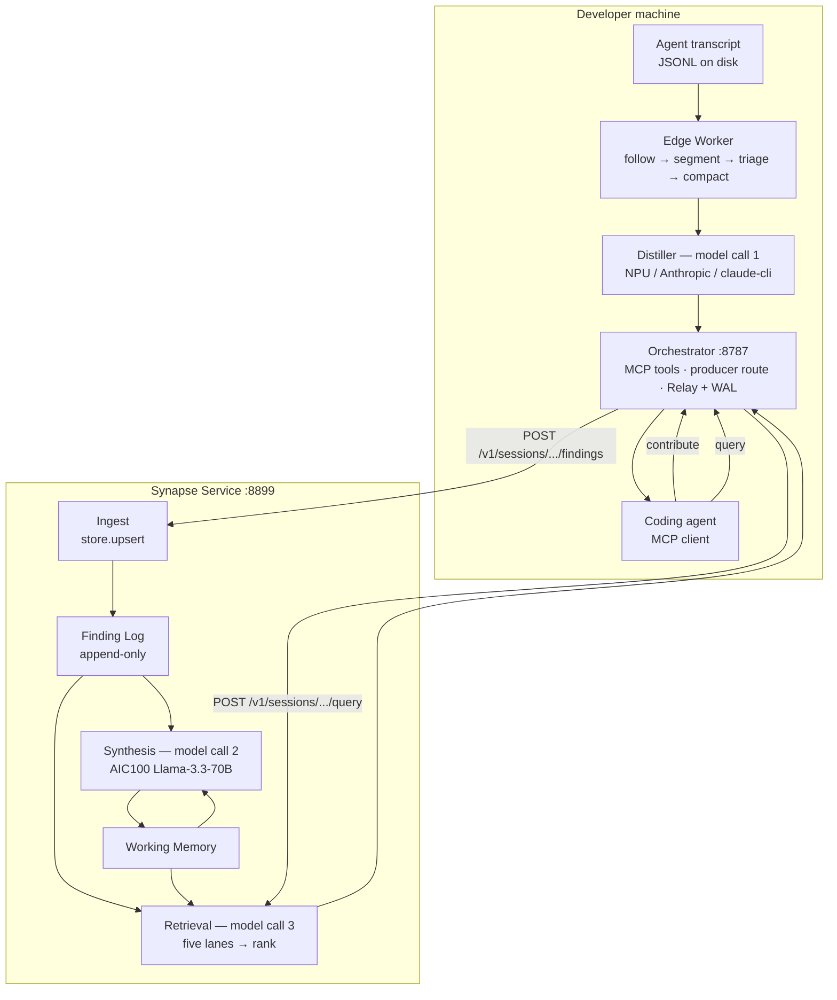

# Architecture

What Synapse does today, on the code as it stands 2026-08-06. Aspirational
material lives in `docs/plans/`; this page describes only shipped behaviour.

Path shorthand, used throughout: `worker/` = `packages/worker/src/synapse_worker/`,
`orchestrator/` = `packages/orchestrator/src/synapse_orchestrator/`,
`service/` = `packages/service/src/synapse_service/`,
`providers/` = `packages/providers/src/synapse_providers/`,
`distiller/` = `packages/distiller/src/synapse_distiller/`. Everything else is
repo-relative.

Vocabulary is `CONTEXT.md`'s and is not redefined here.

## Topology

Two processes per developer machine, one service anywhere.

| Process | Port | Started by | Owns |
|---|---|---|---|
| Edge Worker (`synapse-worker run`) | — (debug dashboard optional) | `worker/cli.py` | read-only transcript access, segmentation, triage, compaction, distillation, its own write-ahead log |
| Orchestrator (`synapse-orchestrator`) | `8787` | `orchestrator/cli.py:189` | the MCP server, `POST /producer/findings`, the Relay, the LocalBinding files |
| Synapse Service (`synapse-service`) | `8899` | `service/cli.py` | one Shared Memory per Shared Session, synthesis, retrieval, `/debug` |
| Model stand-in | `18181` | `scripts/serve_local.py` | replays this repo's corpus so the pipeline runs with no NPU and no cloud key |

`scripts/serve_local.py` boots the service, the orchestrator and the stand-in
(the four URLs at `scripts/serve_local.py:65-68`) and then writes the Shared
Session binding at `scripts/serve_local.py:426`. It does **not** start a worker,
and it deliberately binds a *scratch* transcript path rather than a real one
(`scripts/serve_local.py:20-27`) — the passive path is a separate
`synapse-worker run`.

The orchestrator's MCP transport is streamable HTTP, never stdio, and that is a
decision rather than a preference: stdio spawns one server process per client,
which would give one Orchestrator per agent and dissolve the single-egress
property ADR 0001 exists to create (`orchestrator/app.py:140`,
`orchestrator/server.py:59-61`, `docs/adr/0001-local-orchestrator.md`).

## The pipeline



Three model calls exist in the system: distillation on the edge, the synthesis
merge, and retrieval ranking. Nothing else calls a model.

## 1 — Observation

One `synapse-worker run` follows exactly **one** transcript file with one Source
adapter (`worker/loop.py:148`). A second agent product needs a second process
(`worker/cli.py:343-348`).

Agents are detected, never configured, through `AGENT_REGISTRY` — two entries
today, `claude-code` (`ClaudeCodeSource`, `claude-code-jsonl`) and `codex`
(`CodexSource`, `codex-rollout-jsonl`) — `worker/discovery.py:272-284`.

Each tick (`worker/loop.py:290-434`), in fixed order: re-resolve the binding from
disk, stat-gate on `st_size` (`worker/follower.py:85-91`), read the delta and
truncate at the last `\n` so a partial line is never parsed
(`worker/follower.py:135-149`), parse to `AgentEvent[]`, segment, then triage →
compact → distil → record → push, and persist the offset **last** so a crash
costs duplicated work rather than lost conversation (`worker/loop.py:430`).

Segmentation is two-stage (`worker/segmenter.py:103-190`): a turn boundary is
`role == "user" and kind == "text"` only — tool results also carry `role: "user"`
and must not cut a turn (`worker/segmenter.py:42-44`) — then greedy chunk packing
against `budget_tokens`. The newest turn is held back unless the flush is forced.
Any single event longer than `budget_tokens × 3.5` chars is pre-split
(`worker/segmenter.py:47-80`).

## 2 — Triage

Deterministic code, no model, in the worker: `worker/triage.py`. It decides
whether a Segment reaches the model at all, and it runs **before** compaction —
a keep/skip judgment made against a view compaction reshaped is a judgment made
against evidence compaction chose to show (`worker/loop.py:340-348`).

Triage is recall-tuned and keep-biased by design: a false positive costs ~10s of
NPU time, a false negative is knowledge permanently lost with nothing anywhere to
notice (`worker/triage.py:1-11`). `fixtures/triage.json` records two accepted
false positives as the price.

Compaction (`worker/compaction.py`, wired at `worker/loop.py:38,236-267`) then
reshapes only what the model sees: tool results to 15 head + 15 tail lines,
thinking to 2 lines, trivial read-only results to `""`.

## 3 — Distillation

The distiller compresses and abstracts; it does not judge durability
(ADR 0003). That decision is empirical — a 4B model invented a finding from an
all-noise segment in 6 of 6 configurations and reversed a comparison stated twice
in its own prompt (`docs/adr/0003-distiller-compresses-rather-than-judges.md`).
Judgment moved upstream to triage and downstream to synthesis.

Prompts are versioned packs in `config/prompts/*.toml`; the shipped pack is
`v4-condense` (`config/synapse.toml:35`).

Three provider arms exist, selected by `SYNAPSE_DISTILLER`
(`worker/cli.py:119-156`, mirrored at `orchestrator/cli.py:114-165`):

| `SYNAPSE_DISTILLER` | Provider | Transport | Output cap actually used |
|---|---|---|---|
| `npu` (default) | `NPUProvider` over `providers/openai_compat.py` | HTTP to `config.provider.base_url`, `http://127.0.0.1:18181/v1` | **500** — `min(provider.max_tokens 900, response_reserve 500)` (`distiller/config.py:149-164`, applied `worker/cli.py:143-156`) |
| `anthropic` | `AnthropicProvider` | Messages API | **16000** — constructed with no args, the clamp is not reached (`providers/anthropic_provider.py:89`) |
| `claude-cli` | `ClaudeCliProvider` | local `claude` subprocess | unbounded in practice — the CLI accepts and ignores `max_tokens` (`providers/claude_cli_provider.py:92-103`) |

The two cloud arms exist so several people can exercise the full loop at once
without queueing for the single NPU box (`worker/cli.py:100-108`).

The segment budget is **derived, never a shared constant**
(`distiller/capability.py:51-101`): `usable_context − prompt_overhead −
response_reserve`. On the shipped NPU config that is `4096 − 809 − 500 = 2787`,
which is exactly the pinned `[distiller] segment_budget` in
`config/synapse.toml:96`. A full prompt therefore comes to exactly 4096 with zero
slack — raising the prompt pack's calibrated overhead without lowering the budget
overruns immediately, and nothing validates that pairing at startup.

Two attempts per segment, with a corrective nudge appended on attempt 2 only —
temperature is 0.0, so a byte-identical retry cannot help — then the segment is
dropped (`distiller/distiller.py:46,128-136,173-177`). `assert_prompt_conditioned`
runs before anything is read from the response (`distiller/distiller.py:144-146`).

Attribution is stamped **here, in the worker**, from its own LocalBinding. The
orchestrator preserves it as sent and does not re-stamp: re-stamping picked one
binding across every joined agent product and silently relabelled another
product's Findings (`orchestrator/app.py:16-27`). ADR 0001's text still says the
orchestrator stamps; the code has not done that since 2026-08-04.

## 4 — Push

Two producers, and they do not share a path.

**Passive.** The worker writes `{produced_at, shared_id, finding}` envelopes to
`.synapse/wal/findings.jsonl` **before** any send (`worker/producer.py:242-269`),
then flushes only envelopes whose recorded `shared_id` matches the current
binding — mismatches are held, never retargeted or dropped
(`worker/producer.py:309-364`). The default sink is `file`
(`config/synapse.toml:122-124`); `http` posts to the orchestrator's
`POST /producer/findings` (`orchestrator/app.py:142,201`).

**Active.** `contribute(text)` builds a one-event Segment in-process, runs it
through the real distiller, forces `Provenance.CONTRIBUTED`, and calls
`relay.record()` directly — it does **not** go through `/producer/findings` and
does **not** go through the segmenter, so it has no turn boundary and no token
budget (`orchestrator/server.py:573-616`). `CONTEXT.md`'s "All Producers post the
same shape" is looser than the code.

The egress rule is enforced in one place: the producer body must parse as
`{"findings": [Finding…]}`; segments, events, raw text and unparseable JSON are
422, never forwarded (`orchestrator/app.py:7-9,97-117`). Routing is resolved
**per Finding**, from that Finding's own `attributions[0].agent`, after a
cross-Shared-Session leak was reproduced end-to-end with two products joined to
two different sessions (`orchestrator/app.py:41-67`).

The Relay records to its own append-only WAL, then posts one request per session
to `POST /v1/sessions/{sid}/findings` with a 120s timeout — long because the
synthesis merge runs synchronously inside that POST
(`orchestrator/relay.py:143,243-271,387,459`).

There is no queue and no background worker on the `contribute` path: the tool
call blocks through distillation, the WAL write, the HTTP push and the synthesis
model call.

## 5 — Ingest, and the log

`push_findings` (`service/api.py:469`) gates on liveness, then `store.upsert`.
Findings are queryable **immediately**, before any synthesis
(`service/api.py:478,492-499`). Only then are the debounce and budget gates
consulted.

The Finding Log is append-only, and "visible" is not a field. Supersession,
topic, trivia and termination all resolve by folding the log in order
(`service/fold.py:1-27`). `RETRIEVABLE == not superseded and not marked trivial`
is defined once, at `service/fold.py:131`, and no consumer outside that module
gets the raw entry list.

This is what makes recovery safe: a worker re-pushing its whole durable log after
a service restart is a set of later entries that add no information, while the
merge entry that superseded a finding is still in the log — the fold produces the
same view (ADR 0004, `service/fold.py:7-13`). `upsert` is first-write-wins by id
and skips the append entirely when the stored finding compares equal
(`service/store.py:6-13`, ADR 0005 §8).

`Finding.merged_into` and `Finding.status` are **projected onto egress** from the
View, never written by a producer and never read to decide visibility
(ADR 0004 Option A, `service/store.py:35-45`).

`Finding.provenance` has three members — `distilled`, `contributed`,
`synthesized` — a different axis from Attribution: how a Finding was produced,
not who by (`packages/contracts/src/synapse_contracts/schemas.py:81-86`;
`SYNTHESIZED` written at `service/synthesis.py:426`).

## 6 — Synthesis

One model call per merge round, awaited inline inside the push
(`service/synthesis.py:250`, `service/api.py:542`). `SYNAPSE_SYNTHESIZER` selects
the arm (`service/cli.py:16-41`): `fake` by default, `aic100`
(`AIC100Provider`, Llama-3.3-70B, `POST /completions`), `npu`, or `anthropic`.

`aic100` cannot be pointed at a local GenieX: it deliberately uses
`/completions`, which GenieX does not serve, so every synthesis call 410s and
retrieval turns that into an empty result with a 200 (`service/cli.py:20-29`).

**The output budget is derived, and an impossible configuration is refused**
(ADR 0005). `SynthesisBudget.derive(output_tokens)` at
`service/synthesis.py:110-135`:

```
spare          = output_tokens − JSON_ENVELOPE_TOKENS(40) − MIN_VERDICT_TOKENS(300)
words          = min(MAX_WM_WORDS(500), int(spare / TOKENS_PER_WORD(1.7)))
if words < MIN_WM_WORDS(120): raise SynthesisBudgetError
verdict_tokens = output_tokens − 40 − int(words × 1.7)
max_merges     = max(1, verdict_tokens // TOKENS_PER_VERDICT_ENTRY(70))
```

Verdict room is reserved **first** — a round that reports no merges did not do
its job however good the prose is. The input is the provider's own `max_tokens`
(`service/synthesis.py:137-142`), read through `RecordingProvider`'s explicit
forwarding property (`providers/recording.py:88-121`).

| `output_tokens` | working memory | verdict room | max merges |
|---|---|---|---|
| 800 — `AIC100Provider` default (`providers/aic100.py:152`) | 270 words | 301 tok | 4 |
| 1600 — set by `scripts/serve_local.py:62` (`SYNTHESIS_MAX_TOKENS`, exported as `INFERENCE_CLOUD_MAX_TOKENS` at `:356`) | 500 words | 710 tok | 10 |
| 543 | refused — `SynthesisBudgetError` | | |

The derived numbers are **stated into the prompt** by `synth_system(words,
max_merges)` (`service/synthesis.py:145-175`); the cap is never typed as a
literal. Editing `INFERENCE_CLOUD_MAX_TOKENS` or swapping the synthesis model
re-states it automatically. `INFERENCE_CLOUD_TIMEOUT` must travel with it — a
`ReadTimeout` is caught and reported as the identical "landed, memory unchanged"
symptom (`providers/aic100.py:153,188`, ADR 0005 Consequences).

The merge prompt sees the working memory plus **all** findings in this push and
up to `CANDIDATE_WINDOW = 20` ranked others (`service/synthesis.py:34,274-335`).
Candidates are deliberately *not* trimmed to fit the output budget: a candidate
is an input cost, and input is not the constraint — trimming it left zero
established merge partners in test (ADR 0005, Rejected alternatives).

Order of operations is load-bearing (`service/synthesis.py:1-12`): upsert, then
the model call, then apply verdicts, then bump `memory_version` exactly once. A
model failure after step 1 leaves findings landed and the version unchanged —
degraded quality, zero loss. Unknown ids in verdicts are logged and ignored.

**Merge rate is two limits, not one** (ADR 0005 §7):

- `MERGE_MIN_INTERVAL_S = 60` — a *latency* floor, per session, timestamped
  before the await so concurrent same-session pushes cannot double-merge
  (`service/api.py:48,525`).
- A spend governor over a rolling hour: 25,000 tokens and 20 requests per key
  (`service/api.py:80-82`), pricing the next round at the **max of the last
  five** rather than the mean, and charging failed and truncated rounds too
  (`service/api.py:238-261`).

The two deferral reasons are logged distinctly because their fixes differ:
latency deferral says lower the interval, budget deferral says add keys.

The push response is `{accepted, memory_version, synthesized, deferred, pending}`
(`service/api.py:559-561`); `deferred` separates "we ran a merge and it did not
move the version" from "we chose not to run one yet".

## 7 — Working Memory

A bounded prose summary of the Shared Session, rewritten on each merge, whose
whole reason to exist is keeping the merge prompt fixed-cost regardless of how
much the session accumulated (`CONTEXT.md`).

It is a projection over the Log, not the record — which is why overflow may shed
it, oldest first, and never a verdict: evicted material is still on disk and
rebuildable via `POST /v1/sessions/{sid}/synthesize` (ADR 0005 §5).

## 8 — Retrieval

Five lanes, **unioned, never intersected** — symbols, lexical, vector, topic,
recent (`service/lanes.py:12-18`). The design premise is stated in the module:
this is a recall problem, not a precision problem. A missed candidate is a merge
that never happens, silently and permanently; a spurious one costs about fifty
tokens and the model says "not the same."

Lane scores are incomparable (BM25 8.4, cosine 0.71, symbol rarity 0.5), so
fusion is by **rank** — reciprocal rank fusion with the paper's `RRF_K = 60`,
deliberately untuned against an unmeasured corpus (`service/lanes.py:20-32,56`).
Every candidate records which lanes surfaced it, which is what makes lane yield
measurable.

`GET /v1/sessions/{sid}/watermark` splits its answer deliberately: `version` and
`new_since` are *change* fields and stay global; `by_type` and `conflicts` are
*content* fields and run through the suppression rule. `new_since > 0` with
`by_type == {}` is intended, not a contradiction (`service/api.py:601-640`).

Suppression is applied at two points — once when computing what to exclude from
candidate selection, once again inside `query_findings` before the prompt — with
the rule itself defined exactly once, in `retrieval.visible_to`
(`service/api.py:673-687`, `service/retrieval.py:41-75`). The mechanism: a
Finding is excluded only when **every** Attribution on it names the asking
identity, so a Synthesized Finding carrying any teammate's contribution is always
shown, and a zero-attribution Finding is visible to everyone. **⟨Keying under
revision 2026-08-06 — see `CONTEXT.md` and workstream W2; the guard and the
all-attributions shape are not what is changing.⟩**

Below `TOP_K = 14` (`service/api.py:39`, `service/lanes.py:58`) the route
bypasses lane *selection* — everything the asker may see already fits in one
prompt — but not ordering: handing the model arrival order left the small-session
case with no relevance signal at all, which is every demo and every new team
(`service/api.py:686-700`, amended 2026-08-05).

## 9 — The MCP surface

Six tools, all registered unconditionally at boot, all resolving the binding
fresh inside every call, and **none of them ever raises** — a FastMCP-wrapped
exception string handed to the agent would lose the contributed prose entirely
(`orchestrator/server.py:596-607`).

| Tool | Signature | `orchestrator/server.py` |
|---|---|---|
| `query` | `(question: str) -> str` | `:472` / `:486` |
| `contribute` | `(text: str) -> str` | `:569` / `:573` |
| `create_session` | `(purpose, agent_session_id=None)` | `:640` / `:653` |
| `join_session` | `(shared_id, agent_session_id=None)` | `:731` / `:741` |
| `leave_session` | `() -> str` | `:794` / `:802` |
| `end_session` | `() -> str` | `:856` / `:864` |

Tool descriptions are written in trigger voice — when to call, and what a result
means. `query`'s says a result is a teammate's verified experience rather than a
hypothesis, because a session that retrieved the exact cause of a 401 then spent
three minutes rediscovering it from the filesystem (`orchestrator/server.py:472-485`).

Two non-tool surfaces sit alongside them:

- **The arrival briefing**, carried on MCP's `instructions` field, composed from
  the watermark and hard-capped to headlines — counts and types, never finding
  bodies (`orchestrator/briefing.py:1-6`). It fails open to the unbound default:
  a briefing that can break a session start is worse than no briefing. Service-
  supplied values are stripped of control characters before interpolation, since
  `instructions` is the highest-trust text surface a connecting agent sees.
  Riding `instructions` is what makes it agent-agnostic rather than a per-agent
  hook pack (ADR 0001).
- **`POST /producer/findings`** on the same Starlette app as the MCP surface —
  appended onto FastMCP's own streamable-HTTP app precisely so single egress is
  structural rather than conventional (`orchestrator/app.py:1-9,201`).

The service exposes eight `/v1` routes plus two debug routes
(`service/api.py:762-772`, `service/debug.py:142-160`).

## What does not exist yet

Stated plainly, because several docs in this repo imply otherwise.

- **The topic lane ships OFF.** `DEFAULT_TOPIC_LANE = False`
  (`service/lanes.py:79`), set by measurement: zero yield — 0 partners, 0
  uniquely, at 422 findings and at 2,022. Topics currently earn their place as
  *labels* in the arrival briefing (`orchestrator/briefing.py:129-146`), not as a
  retrieval lane. One line changes the shipped behaviour, the assertions and
  `CONTEXT.md` together.
- **There is no session list.** No `/v1` route enumerates Shared Sessions; the
  only listing anywhere is `/debug/stats.json` (`service/debug.py:143-152`), which
  is unauthenticated and off under `--no-debug`. Discovery of a Shared Session is
  out-of-band — someone sends you the `sh-` id. Roadmap, not shipped.
- **No persistence.** `InMemoryStore` has no cap, no eviction and no disk
  (`service/store.py:11-13`). A service restart drops the Shared Memory; recovery
  is every orchestrator re-pushing its retained log plus `resync`, which is safe
  only because the log is append-only. Each machine holds only its own relay, so
  every contributor must resync.
- **Multi-key round-robin is dead code at both layers.** `AIC100Provider` rotates
  on 429, but the service's pool holds one entry and
  `scripts/local_model_server.py` — which holds the real key — has no rotation at
  all. Adding keys to `secrets.jsonc` today changes nothing (ADR 0005
  Consequences). On one key the governor allows ~6 merge rounds/hour; holding the
  60s floor under sustained load needs ~10 keys.
- **Retrieval is not metered.** Synthesis and retrieval are two `RecordingProvider`
  façades over **one** provider object, hence one key and one hourly ceiling
  (`service/api.py:178-183`), and `/query` never charges `_spend`. A team that
  runs 20 queries and no pushes exhausts the key while `_affordable()` still
  answers True. Deliberately open and documented at `service/api.py:68-79` — the
  constants keep their `SYNTHESIS_` prefix to say exactly what they cover.
- **`contribute(text)` has no input bound.** It bypasses the segmenter entirely,
  so the passive path's whole budget system does not apply; an oversized
  contribution reaches the operator only as `finish_reason=length`
  (`orchestrator/server.py:577-583`, `providers/openai_compat.py:88-116`).
- **`POST /v1/sessions/{sid}/synthesize` is ungated.** It charges spend but never
  checks affordability (`service/api.py:584-594`) — a force-now that can spend
  past the ceiling.
- **One active Agent Session per Agent product per machine.** MCP gives a server
  only `clientInfo: {name, title, version}` at initialize — the client *product*,
  not a conversation — so nothing in the protocol identifies an Agent Session
  (ADR 0001, "Constraint we inherited"). The distilled path is unaffected; it
  never touches MCP.

## Where the numbers come from

Every runtime limit on both paths, with the file:line that sets it and its
effective value under the shipped config, is tabulated in
`docs/overnight/FLOW.md` (2026-08-06). Config knobs live in
`config/synapse.toml`; the capability records that drive the distiller's budget
derivation are `[capability.*]` in that file, read by
`distiller/capability.py:41-124`. Note that the `[capability."Llama-3.3-70B"]`
record is **documentation only** — no code in the service or provider packages
reads it; the synthesis arm is configured entirely through `INFERENCE_CLOUD_*`.
